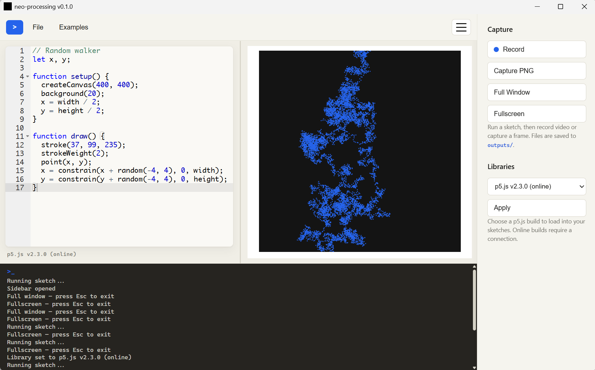

# neo-processing

> A native desktop editor and live runtime for [p5.js](https://p5js.org/)
> sketches — a modern, JavaScript-based alternative to the Java Processing IDE.



neo-processing ships as a **single self-contained executable**. It embeds a code
editor and a live preview into a native desktop window, so you can write a p5.js
sketch on the left and watch it run on the right, with the goal of real-world,
full-screen deployment.

> **Status:** v0.1.0 — active development. Interfaces and features may change.

## Features

- **Native desktop app** — one executable, no browser or Node.js runtime
  required. Uses the OS webview (WebView2 on Windows, WebKitGTK on Linux).
- **Embedded editor** — syntax-highlighting code editor ([Ace](https://ace.c9.io/))
  with a resizable split between source and preview.
- **Live sketch preview** — run your sketch instantly in an isolated, sandboxed
  preview pane.
- **Record & capture** — record the running canvas to WebM video or capture a
  PNG frame, both rendered at the sketch's declared size and saved to `outputs/`.
- **Fullscreen preview** — present the sketch centred at its exact size on a
  white backdrop; press Esc to exit.
- **Local-first & offline** — the frontend and p5.js are embedded into the
  binary and served from a loopback HTTP server; nothing is fetched at runtime.
- **Save to disk** — export the current sketch to a timestamped `.js` file under
  `outputs/`.

### Roadmap

- Full-screen rendering for deployed installations.
- Exporting standalone, editor-free applications per sketch.
- Loading arbitrary additional JavaScript libraries.

## Architecture

neo-processing is a single C++ process:

1. A local HTTP server ([cpp-httplib](https://github.com/yhirose/cpp-httplib))
   binds to `127.0.0.1` on an OS-assigned port.
2. The web frontend (`public/`) is **embedded into the binary at build time**
   and served from that server.
3. A native [webview](https://github.com/webview/webview) window displays the
   frontend.

User sketches run in a `sandbox="allow-scripts"` iframe (opaque origin), so
sketch code cannot reach the local HTTP API, cookies, or storage. The server
listens on loopback only and caps request sizes.

For a deeper description of the codebase, see [AGENTS.md](./AGENTS.md).

## Getting started

### Prerequisites

| Requirement      | Notes |
|------------------|-------|
| CMake ≥ 3.20     | Build system. |
| C++20 compiler   | Windows: Visual Studio 2022 Build Tools (MSVC). Linux: GCC or Clang. |
| Git              | Required — CMake `FetchContent` downloads dependencies from Git. |
| Internet access  | Needed on the **first** configure to download dependencies. |

**Windows runtime:** Microsoft Edge WebView2 Runtime.

**Linux build/runtime libraries:** GTK 3 and WebKit2GTK development files, e.g.

```sh
# Debian/Ubuntu
sudo apt install build-essential cmake git libgtk-3-dev libwebkit2gtk-4.1-dev
```

### Build and run

```sh
# Configure (downloads dependencies on first run)
cmake -B build

# Build
cmake --build build --target neo-processing -j --config Release

# Run
#   Windows: .\build\Release\neo-processing.exe
#   Linux:   ./build/neo-processing
```

Use `--config Debug` (and the `Debug` output folder) for a debug build.

#### Helper scripts

```sh
# Windows — initialises the MSVC environment, configures, builds Debug, and runs.
.\build_and_run.bat

# Linux — configures, builds Debug, and runs.
./build_and_run.sh
```

To produce a distributable build, run `.\build_and_distribute.bat` (Windows): it
builds Release and copies the `build\Release` folder (executable, icons, and any
runtime DLLs) to `%USERPROFILE%\Desktop\neo-processing`.

## Dependencies

Downloaded automatically into the build tree (`build/_deps/`) at configure time;
not committed to the repository:

| Dependency | Purpose |
|------------|---------|
| [cpp-httplib](https://github.com/yhirose/cpp-httplib) | Local HTTP server. |
| [webview](https://github.com/webview/webview) | Native desktop window + system webview. |
| [cpp-embedlib](https://github.com/yhirose/cpp-embedlib) | Embeds `public/` into the executable. |
| Boost (`asio`, `system`) | Async infrastructure thread. |

The frontend libraries in `public/libs/` (Ace, p5.js) are vendored and committed.

## Project layout

```
src/main.cpp        C++ application: HTTP routes, window, shutdown
public/             Frontend, embedded into the binary at build time
  index.html        Layout
  script.js         Editor, menus, file I/O, sketch runner
  style.css         Styling
  libs/             Vendored Ace + p5.js
outputs/            Saved sketches (runtime output)
icons/              Application icons
assets/             README images
CMakeLists.txt      Build configuration
AGENTS.md           Detailed guide for contributors and AI agents
```

## Troubleshooting

- **Windows: MinGW/MSYS2 header conflicts** (`corecrt.h` / `winnt.h` errors). MSVC
  is picking up MinGW headers. Build from a clean *Developer Command Prompt for
  VS*, or use `build_and_run.bat`, which sanitises the environment.
- **Windows: "Windows SDK version … was not found".** A stale `build/CMakeCache.txt`
  references an SDK that is no longer installed. Delete the cache and reconfigure
  (or run `build_and_run.bat`, which clears it automatically).

## Security

The app runs user-provided JavaScript inside a sandboxed WebView and a
loopback-only HTTP server. See [SECURITY.md](./SECURITY.md) for the security
model and how to report a vulnerability.

## License

Released under the MIT License. See [LICENSE](./LICENSE).
